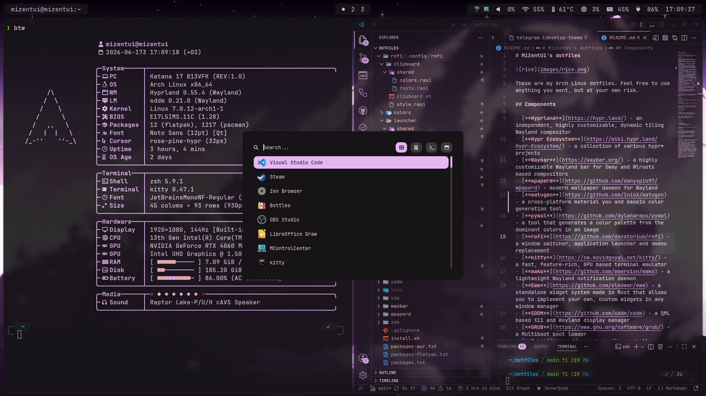

# MiZentUi's dotfiles



These are my Arch Linux dotfiles. Feel free to use anything you want, but at your own risk.

## Components

- [**Hyprland**](https://hypr.land/) - an independent, highly customizable, dynamic tiling Wayland compositor  
- [**Hypr Ecosystem**](https://wiki.hypr.land/Hypr-Ecosystem/) - a collection of various hypr* projects
- [**Waybar**](https://waybar.org/) - a highly customizable Wayland bar for Sway and Wlroots based compositors
- [**wpaperd**](https://github.com/danyspin97/wpaperd) - modern wallpaper daemon for Wayland
- [**rofi**](https://github.com/davatorium/rofi) - a window switcher, application launcher and dmenu replacement
- [**kitty**](https://sw.kovidgoyal.net/kitty/) - a fast, feature-rich, GPU based terminal emulator
- [**mako**](https://github.com/emersion/mako) - a lightweight Wayland notification daemon
- [**Eww**](https://github.com/elkowar/eww) - a standalone widget system made in Rust that allows you to implement your own, custom widgets in any window manager
- [**SDDM**](https://github.com/sddm/sddm) - a QML based X11 and Wayland display manager
- [**GRUB**](https://www.gnu.org/software/grub/) - a Multiboot boot loader
- [**Zsh**](https://www.zsh.org/) - a shell designed for interactive use with [Oh My ZSH!](https://ohmyz.sh/) framework
- [**Vim**](https://www.vim.org/) - the ubiquitous text editor
- [**fastfetch**](https://github.com/fastfetch-cli/fastfetch) - a maintained, feature-rich and performance oriented, neofetch like system information tool
- [**MControlCenter**](https://github.com/dmitry-s93/MControlCenter) - a free and open source GNU/Linux application that allows you to change the settings of MSI laptops

## Installation

This dotfiles are based on [**GNU Stow**](https://www.gnu.org/software/stow/) and an installation shell script.

```shell
# arch linux
sudo pacman -S git stow 

git clone https://github.com/MiZentUi/dotfiles.git
cd dotfiles

chmod +x install.sh
./install.sh           # use -s for stowing only or -h for additional options
```

> **Note**: *If you encounter symlink conflicts during installation, remove the listed directories and try again.*

## Post-Installation

### Git Config

```shell
git config --global user.name "John Doe"
git config --global user.email johndoe@example.com
git config --global init.defaultBranch main
```

[**First-Time Git Setup** - *Pro Git book*](https://git-scm.com/book/ms/v2/Getting-Started-First-Time-Git-Setup)

### SSH

```shell
# ~/.ssh/config

Host github.com
  HostName github.com
  PreferredAuthentications publickey
  IdentityFile ~/.ssh/github
```

[**OpenSSH** - *Arch Wiki*](https://wiki.archlinux.org/title/OpenSSH)

### Hibernation

For hibernation, your swap partition must be at least as large as your RAM (*for 16GB RAM recomended 20GB swap partition*). Also, the `resume` hook is required in `/etc/mkinitcpio.conf` after `udev`.

[**Power management/Suspend and hibernate** - *Arch Wiki*](https://wiki.archlinux.org/title/Power_management/Suspend_and_hibernate)

## References

- [**Sevenix2 Wallpapers**](https://www.reddit.com/user/Sevenix2/) - Genshin Impact wallpapers by Sevenix2
- [**rofi themes**](https://github.com/adi1090x/rofi) - a huge collection of Rofi based custom applets, launchers & powermenus
- [**Harshwardhan Patil's .dotfiles**](https://github.com/harsh-m-patil/.dotfiles) - used as a base for the initial Waybar configuration
- [**fastfetch-configs**](https://github.com/SoupCat-Py/fastfetch-configs) - initial reference for my fastfetch configuration
- [**Sugar Candy SDDM theme**](https://framagit.org/MarianArlt/sddm-sugar-candy) - is the sweetest login theme available for the SDDM display manager
- [**grub2-themes**](https://github.com/vinceliuice/grub2-themes) - modern design theme for GRUB
- [**"Activate Linux"**](https://github.com/Nycta-b424b3c7/eww_activate-linux) - widget text for Eww
- [**cliphist**](https://github.com/sentriz/cliphist) - a wayland clipboard manager with support for multimedia; `cliphist-rofi-img.sh` sourced from this repo
